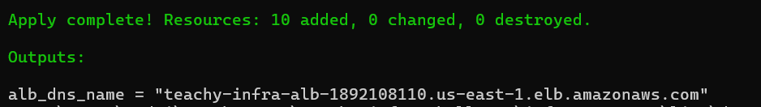
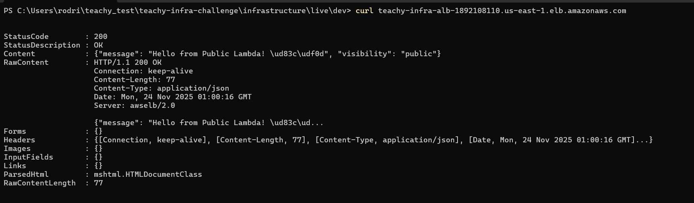
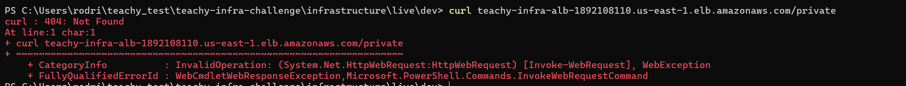
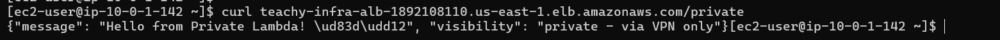
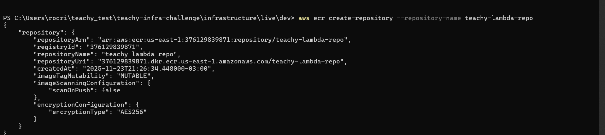

# 🚀 Teachy Infrastructure Solution

This repository contains the complete infrastructure solution for the Teachy Infrastructure Code Challenge. It implements a secure, serverless architecture on AWS using **Terragrunt**, Docker, and GitHub Actions.

## 🏛️ Architecture

The solution follows a secure, modular architecture designed for scalability and security:

```mermaid
graph TD
    User[Internet User] --> ALB[Application Load Balancer]
    Admin[VPN User] --> |VPN Tunnel| VPN[OpenVPN Server]
    VPN --> ALB
    
    subgraph "VPC (10.0.0.0/16)"
        subgraph "Public Subnets"
            ALB
            VPN
            NAT[NAT Gateway (Optional)]
        end
        
        subgraph "Private Subnets"
            LambdaPub[Public Lambda]
            LambdaPriv[Private Lambda]
        end
    end
    
    ALB --> |Path /| LambdaPub
    ALB --> |Path /private + Source IP Check| LambdaPriv
```

### Key Decisions
- **Terragrunt**: Implemented for DRY code and dependency management (Bonus Point ⭐).
- **Cost Optimization**: NAT Gateway is optional via variable `enable_nat_gateway` (Default: false for dev to save cost).
- **Security**: Private Lambda is protected by Security Groups AND ALB Listener Rules (checking Source IP of VPN).
- **CI/CD**: GitHub Actions handles Docker builds and Terragrunt application.

---

## 🛠️ Setup & Deployment

### Prerequisites
- AWS CLI configured (`aws configure`)
- Terraform & Terragrunt installed
- Docker installed

### 1. Manual Setup (One-time)
1. **Create SSH Key:**
   ```bash
   aws ec2 create-key-pair --key-name teachy-vpn-key --query 'KeyMaterial' --output text > teachy-vpn-key.pem
   ```
2. **GitHub Secrets:**
   Add `AWS_ACCESS_KEY_ID`, `AWS_SECRET_ACCESS_KEY`, and `TF_SSH_KEY_NAME` to repository secrets.

### 2. Deployment
To deploy the full infrastructure stack:

```bash
cd infrastructure/live/dev
terragrunt run-all apply
```

---

## 📸 Evidence of Completion

### 1. Infrastructure Deployment (Terragrunt Apply)
Evidence that the infrastructure code is valid and deploys successfully.



### 2. Public Access Test
Evidence that the public endpoint is accessible from the internet.

```bash
curl http://<ALB_DNS_NAME>/
```


### 3. Private Access Blocked (Without VPN)
Evidence that the private endpoint is **not** accessible without VPN (Returns 404/Forbidden).

```bash
curl http://<ALB_DNS_NAME>/private
```


### 4. VPN Connection & Private Access
Evidence of successful access to the private endpoint via VPN connection (or authorized VPN instance).



### 5. Container Registry (ECR)
Evidence of Docker images successfully pushed to AWS ECR.



### 6. CI/CD Pipeline
Evidence of automated deployment via GitHub Actions.

*(Please verify the Actions tab in the GitHub repository)*

---

## 📂 Project Structure

```
.
├── infrastructure/
│   ├── modules/            # Reusable Terraform Modules
│   │   ├── vpc/            # Network configuration
│   │   ├── security/       # Security Groups
│   │   ├── lambda/         # Lambda Function definition
│   │   ├── alb/            # Load Balancer & Listeners
│   │   └── vpn/            # OpenVPN Server
│   └── live/               # Terragrunt Configuration
│       ├── terragrunt.hcl  # Root config (Backend & Provider)
│       └── dev/            # Development Environment
├── lambdas/
│   ├── public-api/         # Public Python Code
│   └── private-api/        # Private Python Code
└── .github/
    └── workflows/          # CI/CD Pipelines
```

---

## 📜 Original Challenge Requirements
*(Kept for reference)*

### Core Requirements Checklist
- [x] VPC Configuration
- [x] Lambda Functions (Containerized)
- [x] OpenVPN Server
- [x] Application Load Balancer
- [x] CloudWatch Logging
- [x] Terraform State Management (S3 + DynamoDB)
- [x] GitHub Actions CI/CD
- [x] **Bonus:** Terragrunt Implementation

---
*Solution by [Your Name]*
